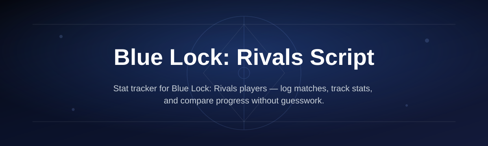
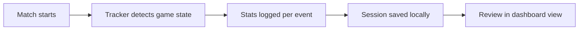

# blue-lock-rivals-stat-tracker

*A stat tracker for Blue Lock: Rivals players who are tired of screenshotting their own match history.*

## What this is

**blue-lock-rivals-stat-tracker** is a lightweight companion tool for Blue Lock: Rivals, the Roblox game built around the Blue Lock anime. It watches your matches and logs the numbers the in-game UI won't show you in one place — flow state uptime, shot accuracy across positions, ego trigger frequency, and how your stat growth actually trends across sessions.

I started this because I kept losing track of whether my striker build was actually improving or if I was just imagining progress. The in-game stat screen resets context every match, so there was no way to see the arc. This tool exists to fix that one specific problem, nothing more.

  

The button above opens the project's landing page, where you can download the current build.

## Who it is for

**Players grinding position ranks** — anyone trying to prove their winger or defender build is actually improving, not just leveling.

**Team captains** — people running scrims who want a quick read on which teammates are underperforming their position.

**Build theorycrafters** — players comparing stat allocation strategies across multiple runs instead of guessing from memory.

**Returning players** — anyone who stopped playing mid-season and wants to see how their stats decayed or held up.

## What you can do

- **Log per-match stats** automatically as you play, without pausing to write anything down
- **Track flow state windows** — duration, trigger frequency, and how often you waste it
- **Compare position performance** across striker, midfielder, defender, and goalkeeper runs
- **Chart stat growth over time** instead of relying on a single-match snapshot
- **Flag stat regressions** so you notice a drop before it costs you a match
- **Export session summaries** as plain text for sharing with a team or squad
- **Filter history by opponent or mode** to spot patterns in specific matchups
- **Run entirely locally** — nothing is uploaded, nothing touches your Roblox account credentials

## Getting started

1. Open the landing page using the download button above.
2. Download the current build for Windows.
3. Extract the folder anywhere on your machine.
4. Run the executable, then launch Blue Lock: Rivals as usual.
5. Play a match — the tracker starts logging automatically once it detects the game window.

## Requirements

- **Windows 10 or 11**, 64-bit
- **Standalone executable** — no Python, Node, or build toolchain needed
- **Blue Lock: Rivals** installed and running through Roblox
- No admin rights required for normal use

## How it works

The tracker reads match state passively while you play, then stores structured logs locally so you can review them after the session ends.

1. Launch the tracker before or after opening the game — order doesn't matter.
2. It waits quietly until it detects an active Blue Lock: Rivals session.
3. Every relevant event — shot, tackle, flow trigger — gets timestamped and logged.
4. When the match ends, the session is saved to your local history.
5. Open the dashboard view anytime to compare sessions side by side.

## Common Pitfalls

**"Why isn't the tracker picking up my match?"**
It only starts logging once it detects an active game window. Make sure Blue Lock: Rivals is running and you're already in a match, not just the lobby.

**"Does this modify anything inside the game?"**
No. It only reads visible match data and logs it externally — it doesn't touch game files or inject anything into the client.

**"Will this get flagged for using a third-party tool?"**
It runs outside the game and doesn't alter gameplay, so it behaves like an overlay tracker, not a gameplay modifier. Use your own judgment based on current game rules.

**"Can I use this on a Chromebook or Mac?"**
Not currently. This build targets Windows only.

**"Does it work after a Blue Lock: Rivals game update?"**
Usually yes, since it reads visible data rather than game internals. If a major UI overhaul breaks detection, check the landing page for an updated build.

## Troubleshooting

**Tracker opens but shows no data** — confirm you're in an active match, not the pre-game lobby. Detection only starts once gameplay begins.

**Window closes immediately on launch** — check that your antivirus hasn't quarantined the executable. Restore it from quarantine and try again.

**Stats look duplicated or doubled** — this usually means two instances of the tracker are running. Close all instances and relaunch a single copy.

**Dashboard won't open after an update** — delete the local cache folder inside the extracted directory and relaunch; it will rebuild automatically.

## License

Released under the [MIT License](LICENSE). This is an independent fan-made tool and is not affiliated with, endorsed by, or connected to the developers of Blue Lock: Rivals or Roblox Corporation.

  

